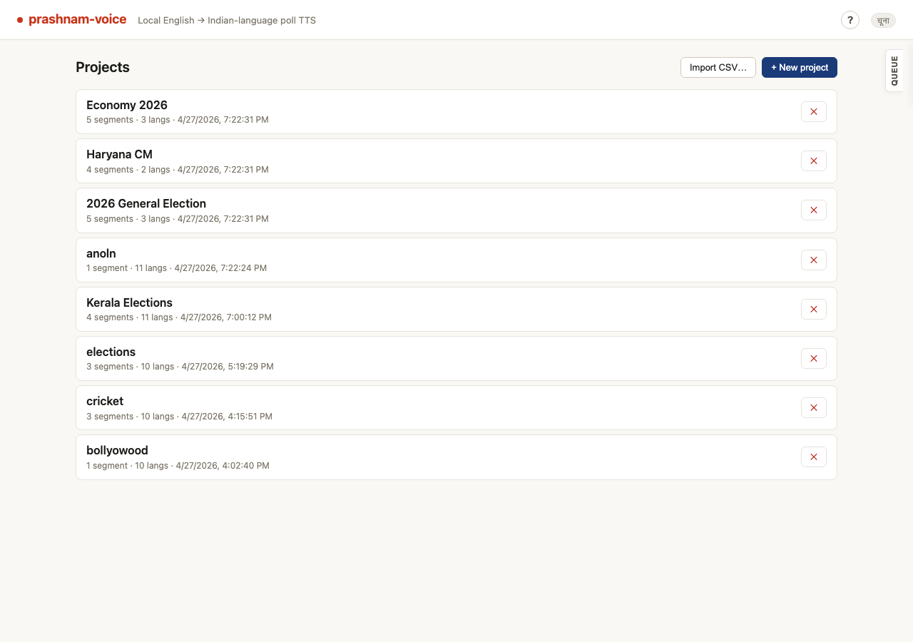
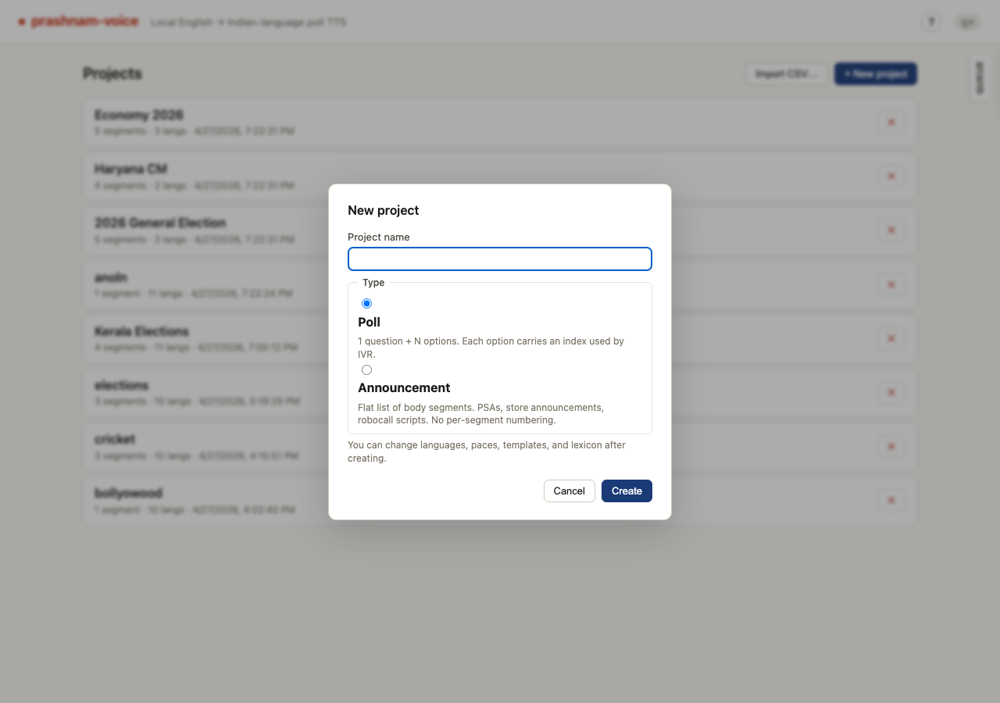
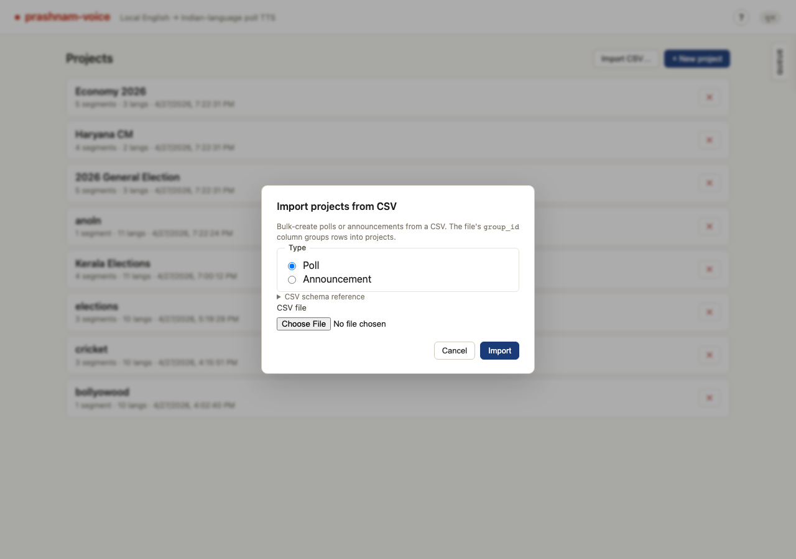
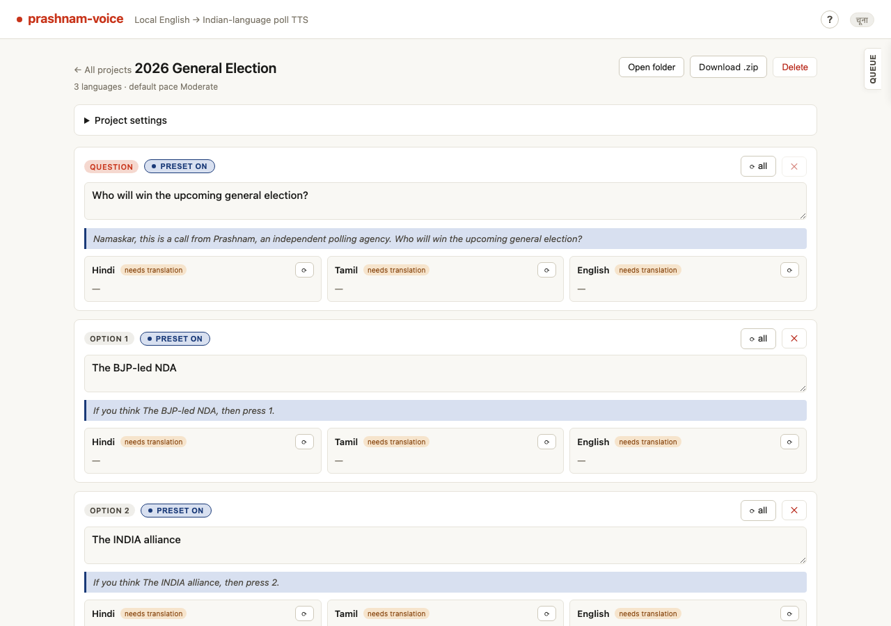
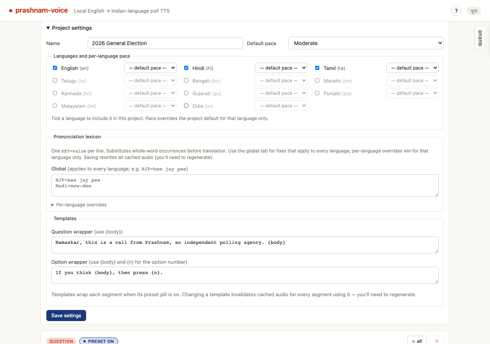
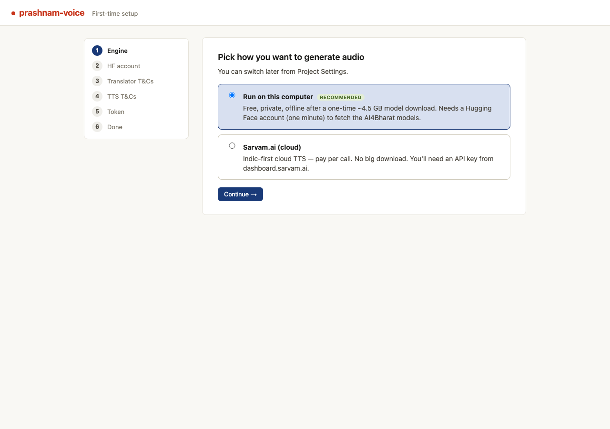
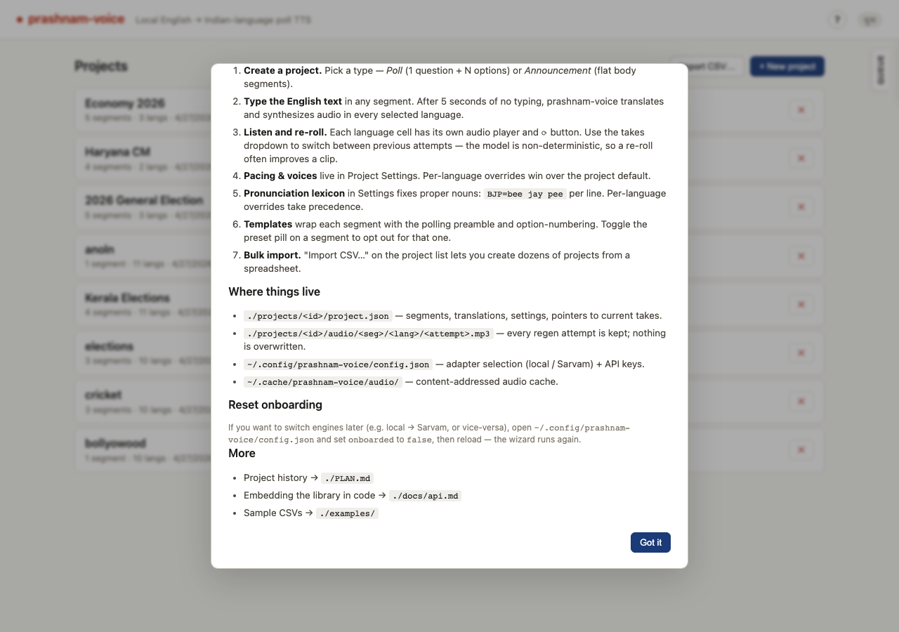

# prashnam-voice guide

A visual tour of the main features.

## Project list

The home page lists every project on disk, with segment count, language count, and last-updated time. The header buttons open dialogs for creating a single project or bulk-importing from CSV.

## New project

Pick a type (Poll = one question with N indexed options; Announcement = flat body segments), name the project, and create. Languages, paces, templates, and lexicon can all be edited later.

## Import projects from CSV

Bulk-create polls or announcements from a single CSV. The `group_id` column groups rows into projects; expand "CSV schema reference" for the full column list.

## Project editor

Each segment shows its source text, the rendered IVR wrapper, and per-language translation cells. Tags like "preset on" and "needs translation" make it obvious what still needs work.

## Project settings

The collapsed disclosure expands into Languages (with per-language pace overrides), Pronunciation lexicon (global plus per-language), and Templates (the IVR wrappers around questions and options).

## Onboarding wizard

First-time setup walks through engine choice, Hugging Face account, T&Cs, and token entry. The "Run on this computer" engine ships the AI4Bharat models locally; "Sarvam.ai (cloud)" uses an API key instead.

## Help

The "?" button in the topbar opens a Quick start checklist plus pointers to where projects, lexicons, and templates live on disk, and how to reset onboarding.
