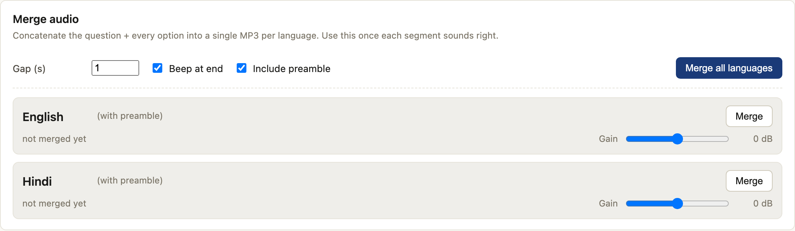
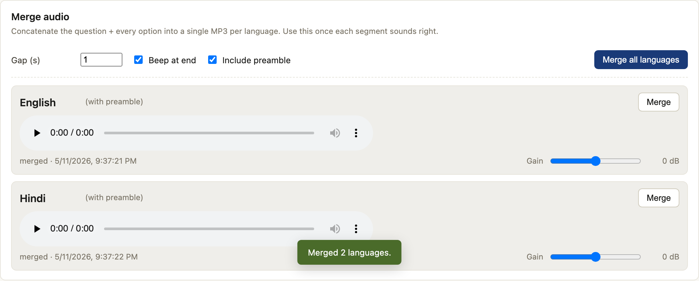
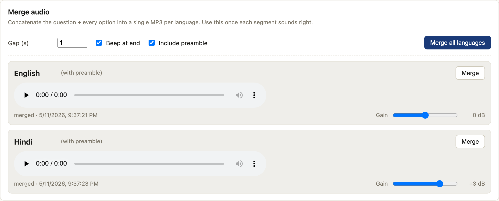
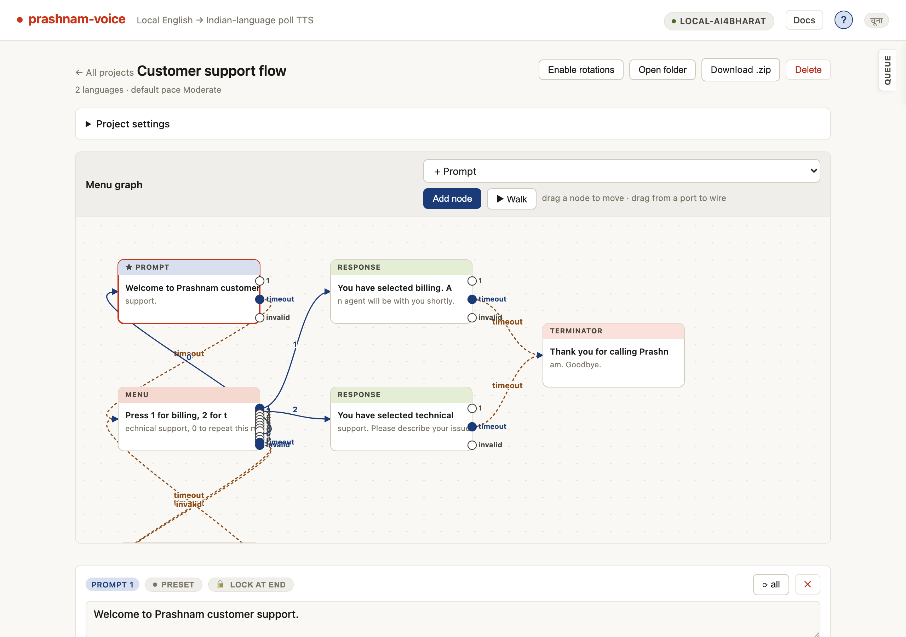
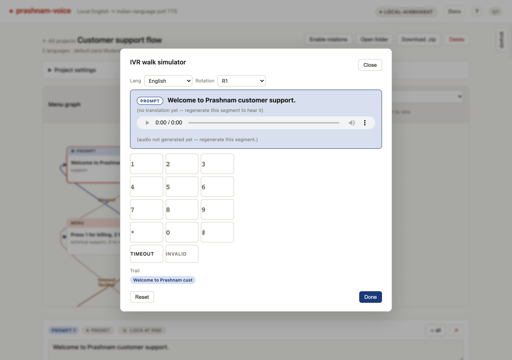

# prashnam-voice guide

A visual tour of the main features.

## Project list

The home page lists every project on disk, with segment count, language count, and last-updated time. The header buttons open dialogs for creating a single project or bulk-importing from CSV.

## New project

Pick a type (**Poll** = one question with N indexed options; **Announcement** = flat body segments; **IVR menu** = branching call flow), name the project, and create. Languages, paces, templates, and lexicon can all be edited later.

## Import projects from CSV

Bulk-create polls or announcements from a single CSV. The `group_id` column groups rows into projects; expand "CSV schema reference" for the full column list.

## Project editor

Each segment shows its source text, the rendered IVR wrapper, and per-language translation cells. Tags like "preset on" and "needs translation" make it obvious what still needs work.

## Project settings

The collapsed disclosure expands into Languages (with per-language pace overrides), Pronunciation lexicon (global plus per-language), and Templates (the IVR wrappers around questions and options).

## Merging audio for IVR upload  (poll only)

Below the segments grid on every poll project, "Merge audio" assembles the question + every option (in canonical order) into a single MP3 per language — the format most IVR systems want to ingest. Three knobs across the top:

- **Gap (s)** — silence inserted between segments. Defaults to 1.0 s; bump it up for slower-paced flows or down for tight ones.
- **Beep at end** — appends a short 800 Hz pulse so the IVR knows the prompt has finished. On by default.
- **Include preamble** — picks between the templated lead-in ("Namaskar, this is a call from Prashnam…") and the bare-body version of the question. Toggling this changes which variant the Merge button produces.

All three settings persist per project — the next merge starts with whatever you last used.

"Merge all languages" runs every selected language in one pass and inline `<audio>` players appear with the result. Per-language **Merge** buttons re-roll just one row when you've fiddled with that language alone. The variant label next to each language name (e.g. "(with preamble)") makes it obvious which file the player is loading.

Merged files land under `projects/<id>/merged/<lang>_with_preamble.mp3` (or `_no_preamble.mp3`) and are bundled into the project zip alongside the per-segment audio.

### Per-language gain

TTS voices don't all hit the same loudness — every clip is normalized to -16 LUFS during synthesis, but if one language still sounds quieter than the rest you can rescue it with the per-language **Gain** slider (capped at ±6 dB). Release the slider and the row auto-re-merges; the audio player picks up the new file automatically. The slider value is saved per project, so the next merge applies it without any extra clicks.

### Out-of-date hint
Any time you re-roll a segment's audio after merging, the affected language row turns amber and the status line reads "out of date — re-merge after regenerating." Hit **Merge** on that row (or **Merge all languages**) to refresh.

## Onboarding wizard

First-time setup is just two clicks: pick an engine, then download. The "Run on this computer" engine ships the AI4Bharat models locally — no Hugging Face account, no token, no T&Cs click-through (we mirror the weights ungated under [`naklitechie/*`](https://huggingface.co/naklitechie)). "Sarvam.ai (cloud)" uses an API key instead.

## Help

The "?" button in the topbar opens a Quick start checklist plus pointers to where projects, lexicons, and templates live on disk, and how to reset onboarding.

## IVR DAG editor

IVR projects render as a node-graph. Five segment types — `prompt`, `menu`, `response`, `bridge`, `terminator` — wired by DTMF edges (`1`–`9`, `0`, `*`, `#`) plus `timeout` and `invalid` fall-throughs. Drag nodes to move; drag from a port to wire an edge. Click a node to edit its text + audio in the segment editor below.

## IVR walk simulator

"▶ Walk" opens a 12-key DTMF keypad (plus `timeout` / `invalid` chips) that plays the active node's audio in your chosen language. Pressing a key follows the matching edge; a breadcrumb trail shows the path. Stops on a terminator or an unmapped key. End-to-end dry runs without a phone in the loop.
